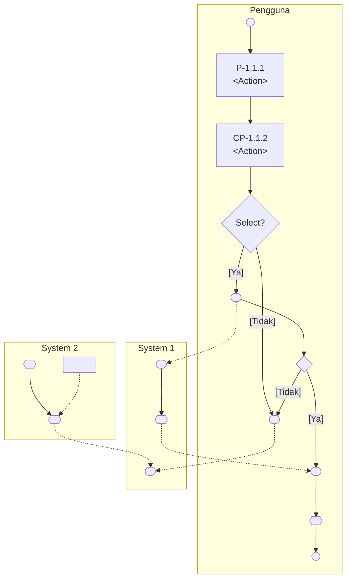

# Requirement

MIMOS SOLUTIONS <Insert customer logo>

# <Project Name>
# User Requirement Specification

<table>
  <tbody>
    <tr>
        <td>File Name</td>
        <td>Go to Insert $\rightarrow$ Quick Parts $\rightarrow$ Field $\rightarrow$ Filename $\rightarrow$ Format $\rightarrow$ (none)</td>
    </tr>
    <tr>
        <td>Issuance Department</td>
        <td>Software Quality Assurance (SQA)</td>
    </tr>
  </tbody>
</table>

This document contains confidential and sensitive information. The information contained within should not be reproduced or redistributed without prior written consent from MIMOS Solutions Sdn. Bhd. and <Customer>.

# Review and Approval Record

<table>
  <thead>
    <tr>
        <th colspan="5">Document Originator / Author</th>
    </tr>
    <tr>
        <th>Name</th>
        <th>Title</th>
        <th>Department</th>
        <th>Signatory</th>
        <th>Date</th>
    </tr>
  </thead>
</table>
<table>
  <thead>
    <tr>
        <th colspan="5">Document Reviewer</th>
    </tr>
    <tr>
        <th>Name</th>
        <th>Title</th>
        <th>Department</th>
        <th>Signatory</th>
        <th>Date</th>
    </tr>
  </thead>
</table>
<table>
  <thead>
    <tr>
        <th colspan="5">Document Approver</th>
    </tr>
    <tr>
        <th>Name</th>
        <th>Title</th>
        <th>Department</th>
        <th>Signatory</th>
        <th>Date</th>
    </tr>
  </thead>
</table>

# Table of Contents

**LIST OF FIGURES.................................................................................................................................7**
**LIST OF TABLES..................................................................................................................................8**
**ACRONYMS AND ABBREVIATIONS...................................................................................................9**
**GLOSSARY / DEFINITION..................................................................................................................10**
**1.0 INTRODUCTION......................................................................................................................11**
1.1 PURPOSE...........................................................................................................................11
1.2 SCOPE................................................................................................................................11
1.3 INTENDED AUDIENCE......................................................................................................11
1.4 REFERENCES....................................................................................................................12
1.5 STANDARDS......................................................................................................................12
**2.0 OVERVIEW..............................................................................................................................13**
2.1 BACKGROUND..................................................................................................................13
2.2 SCOPE OF WORK.............................................................................................................13
2.3 CURRENT BUSINESS PROCESS AND OPERATIONAL CONSTRAINTS......................13
2.3.1 CHALLENGES AND AREAS FOR IMPROVEMENT...................................................14
2.4 PROPOSED SOLUTION....................................................................................................15
2.4.1 PROPOSED FUNCTIONAL MODULES......................................................................16
2.5 SYSTEM USERS................................................................................................................16
**3.0 FUNCTIONAL REQUIREMENTS............................................................................................17**
3.1 <MODULE #1>....................................................................................................................17
3.1.1 BUSINESS PROCESS DIAGRAM...............................................................................17
3.1.2 FEATURE LIST............................................................................................................18
3.2 <MODULES #2>.................................................................................................................19
3.2.1 BUSINESS PROCESS DIAGRAM...............................................................................19
3.2.2 FEATURE LIST............................................................................................................19
**4.0 NON-FUNCTIONAL REQUIREMENTS (NFR)........................................................................20**
**5.0 ASSUMPTIONS AND DEPENDENCIES.................................................................................20**
**6.0 OPEN ISSUES.........................................................................................................................21**
**APPENDICES......................................................................................................................................22**
APPENDIX A: <TITLE>....................................................................................................................22
APPENDIX B: <TITLE>....................................................................................................................22

# List of Figures

FIGURE 1: SAMPLE DIAGRAM.........................................................................................................14
FIGURE 2: SAMPLE BUSINESS FUNCTIONAL HIERARCHY DIAGRAM.......................................15
FIGURE 3: SAMPLE PROCESS DIAGRAM......................................................................................18
FIGURE 4: <FIGURE NAME>.............................................................................................................22

# List of Tables

TABLE 1: LIST OF REFERENCES.....................................................................................................12
TABLE 2: LIST OF STANDARDS.......................................................................................................12
TABLE 3: AREAS FOR IMPROVEMENT IN <PROCESS NAME>....................................................14
TABLE 4: LIST OF MODULES............................................................................................................16
TABLE 5: LIST OF USER CLASS/ROLES AND CHARACTERISTICS/RESPONSIBILITIES...........16
TABLE 6: LIST OF FEATURES FOR <MODULE 1>..........................................................................18
TABLE 7: LIST OF FEATURES FOR <MODULE 2>..........................................................................19
TABLE 8: LIST OF NON-FUNCTIONAL REQUIREMENTS FOR <SYSTEM/MODULE>..................20
TABLE 9: LIST OF ASSUMPTIONS...................................................................................................20
TABLE 10: LIST OF OPEN ISSUES...................................................................................................21
TABLE 11: <TABLE NAME>...............................................................................................................22

# Acronyms and Abbreviations

<table>
  <thead>
    <tr>
        <th>Acronyms / Abbreviations</th>
        <th>Definition</th>
    </tr>
  </thead>
  <tbody>
    <tr>
        <td>MIMOS Solutions</td>
        <td>MIMOS Solutions Sdn. Bhd. (Formerly known as MIMOS Technology Solutions Sdn. Bhd.)</td>
    </tr>
  </tbody>
</table>

[*Note:*
1. *Sort the acronyms/ abbreviations in alphabetical order.*

*]*

## Glossary / Definition

<table>
  <tbody>
    <tr>
        <td>Glossary</td>
        <td>Definition</td>
    </tr>
    <tr>
        <th></th>
        <th></th>
    </tr>
  </tbody>
</table>

[*Note:*
1. *Sort the glossary/ definitions in alphabetical order.*

*]*

# 1.0 Introduction

## 1.1 Purpose
This document details the business requirements for the <Project Name>. The objective of this document is for MIMOS Solutions’ project team members to work with <Customer> to analyse the business requirements for the development of the <Project Name> System.

## 1.2 Scope
<This section shall describe the scope of this document. Include supporting documents referred and need to be used to supplement the information in this section.>

Example:

The scope of this document is to state the high-level business requirement for the <Project Name> which covers modules listed in section 2.3. This document shall also refer to <Document Name> for common features.

## 1.3 Intended Audience
< This section shall describe the intended or target audience of this document.>

Example:

This document is intended to be used as reference by the project team in preparing SRS document, system design, and implementation of the system development and testing.

### 1.4 References
The following are the reference documents used, for detailing the business requirements for the <Project Name>: -

<table>
  <thead>
    <tr>
        <th>No.</th>
        <th>References</th>
        <th>Provided by</th>
    </tr>
  </thead>
  <tbody>
    <tr>
        <td>1.</td>
        <td>&lt;Example&gt; Dasar Keselamatan Sektor Awam</td>
        <td>MAMPU</td>
    </tr>
  </tbody>
</table>
**Table 1: List of References**

### 1.5 Standards
<This section shall identify all internal and external standards that will be adhered to in the development of the system. This will also identify those external standards that have been specified by the customer (this can be extracted from contract or tender spec). In case there are corresponding internal standards, this section shall outline the reasons for not using the internal standards.>

<table>
  <thead>
    <tr>
        <th>No. [thead]	Standards [thead]	Purpose [thead]	Reference</th>
        <th colspan="2"></th>
    </tr>
  </thead>
  <tbody>
    <tr>
        <td>1.	Capability Maturity Model Integration V3, Development	Standard guideline for template	MIMOS Solutions</td>
        <td colspan="2"></td>
    </tr>
    <tr>
        <td>2.</td>
        <td></td>
        <td></td>
    </tr>
  </tbody>
</table>
**Table 2: List of Standards**

## 2.0 Overview

### 2.1 Background
<Describe at the organization level the reason and **background** for which the organization is pursuing new business or changing the current business in order to fit a new management environment.

In this context it should describe:

[ ] How the proposed system will contribute to meeting business model, goal and objectives.

[ ] Scope of the work to be done and scope of the system being developed or changed. The boundary of the work shall be clearly set, by specifying what will be done and more importantly what will not be done.>

### 2.2 Scope of Work
<Describe the scope of work.>

### 2.3 Current Business Process and Operational Constraints
<This section is to document the gap analysis, where an understanding of the current business process is useful in establishing the basis for a new improved process.

Describe current business process and business structure (e.g. system activities and process flow).

Identify current business operation constraints and problems (gap analysis). When doing this it is useful to consider opportunities for improvement for all problems identified. Also, clearly document any legislative changes required (including business operational policies and rules)

[ ] If there is an existing document describing current process, please make reference to here.

[ ] If the current process does not exist then omit this sub-section.

A diagrammatic description can be used to describe an impacted, removed or new process. Sample as Figure 1, show impacted changes on the current system and scope of the system being developed or changed.>

[The image shows a large rectangular placeholder box containing a smaller yellow square at the top center and a small white square at the bottom left, representing a sample diagram area.]

**Figure 1: Sample Diagram**

### 2.3.1 Challenges and Areas for Improvement
<Describe the current challenges and areas for improvement in current system based on the analysis gathered during the requirement workshop.>

<table>
  <thead>
    <tr>
        <th>Current Challenges and Areas for Improvement</th>
        <th>Suggestion for Improvement</th>
    </tr>
  </thead>
  <tbody>
    <tr>
        <td>• E.g. Email missing vital information about the library resources thus Responder had to search again for library resources information.</td>
        <td>• E.g. Custom email template for notification and reminder.</td>
    </tr>
  </tbody>
</table>
**Table 3: Areas for Improvement in <Process Name>**

## 2.4 Proposed Solution

<Describe the proposed solution to address the challenges and areas for improvements. Include To-Be System Scope and Contex Diagram if necessary including information on the Business Functional Hierarchy Diagram which includes components such as systems, subsystems, functions, modules, submodules and transactions.>

<Example:>

[The image shows a large empty rectangular box with a smaller pink rectangular box centered at the top, intended as a placeholder for a diagram.]

**Figure 2: Sample Business Functional Hierarchy Diagram**

### 2.4.1 Proposed Functional Modules
<Modules can represent business model, business unit or business structure. Please change the title accordingly.>

This section specifies the modules covered and its business purpose.

<table>
  <thead>
    <tr>
        <th>No.</th>
        <th>Modules</th>
        <th>Sub-Modules</th>
        <th>Purpose</th>
    </tr>
  </thead>
  <tbody>
    <tr>
        <td>1.</td>
        <td>Admin (ADM)</td>
        <td>User Management (UM)</td>
        <td>In this module, user can manage user information.</td>
    </tr>
  </tbody>
</table>
**Table 4: List of Modules**

### 2.5 System Users
<Define all system user class/roles and their characteristics/responsibilities.>

<table>
  <thead>
    <tr>
        <th>No.</th>
        <th>User Class/Roles</th>
        <th>Characteristics/Responsibilities</th>
    </tr>
  </thead>
  <tbody>
    <tr>
        <td>1.</td>
        <td>Chemists</td>
        <td>Chemists will use the system to request chemicals from vendors and from the chemical stockroom. Each chemist will use the system several times per day, mainly for tracking chemical containers in and out of the laboratory. The chemists need to search vendor catalogs for specific chemical structures imported from their current structure drawing tools.</td>
    </tr>
  </tbody>
</table>
**Table 5: List of User Class/Roles and Characteristics/Responsibilities**

## 3.0 Functional Requirements

Functional requirements of the system or system element functions or tasks to be performed can be prioritized using MoSCoW rules as per below.

**Must Have (M):** The requirement is essential, key stakeholder needs will not be satisfied if this requirement is not delivered and the time box will be considered to have failed.

**Should Have (S):** This is an important requirement but if it is not delivered within the current time box, there is an acceptable workaround until it is delivered during a subsequent time box.

**Could Have (C):** This is a ‘nice to have’ requirement; we have estimated that it is possible to deliver this in the given time but will be one of the requirements de-scoped if we have underestimated.

**Won't Have (W):** The full name of this category is ‘Would like to have but Won’t Have during this time box; requirements in this category will not be delivered within the time box that the prioritisation applies to.

## 3.1 \<Module #1>

\<Modules can represent business model, business unit or business structure. The title shall align with section 2.3>

### 3.1.1 Business Process Diagram

\<Insert and describe the business process diagram in a high-level manner.

In this context operational scenario should be included, which describe examples of how users/operators/maintainers will interact with the system (context of use). The scenarios are described for an activity or a series of activities of business processes supported by the system.>

\<Example:>

**Figure 3: Sample Process Diagram**

### 3.1.2 Feature List
&lt;Column Source indicates source of requirements, example: SOW, contract, requirement workshop and policies. If not use, please remove the column.

Column Features indicating the operational features that are to be provided without specifying design details (including modes of system and support environment).&gt;

&lt;Example: &gt;

<table>
  <thead>
    <tr>
        <th>FR ID</th>
        <th>Features</th>
        <th>Source</th>
        <th>Priority</th>
    </tr>
  </thead>
  <tbody>
    <tr>
        <td>PM-1.1</td>
        <td>The system shall have the ability to register a new user.</td>
        <td>COMMON SoW 3.1, 15.3  LITE SoW 1.1, 1.12</td>
        <td>M</td>
    </tr>
    <tr>
        <td>PM-1.2</td>
        <td>The system shall allow the user to set which is the primary reference ID.</td>
        <td>Workshop 2</td>
        <td>M</td>
    </tr>
  </tbody>
</table>

**Table 6: List of Features for &lt;Module 1&gt;**

## 3.2 <Modules #2>
<Modules can represent business model, business unit or business structure. The title shall align with section 2.3>

### 3.2.1 Business Process Diagram
<Insert and describe the business process diagram in a high-level manner.

In this context operational scenario should be included, which describe examples of how users/operators/maintainers will interact with the system (context of use). The scenarios are described for an activity or a series of activities of business processes supported by the system.>

### 3.2.2 Feature List
<Column Source indicates source of requirements, example: SOW, contract, requirement workshop and policies. If not use, please remove the column.

Column Features indicating the operational features that are to be provided without specifying design details (including modes of system and support environment).>

<table>
  <thead>
    <tr>
        <th>FR ID</th>
        <th>Features</th>
        <th>Source</th>
        <th>Priority</th>
    </tr>
  </thead>
  <tbody>
    <tr>
        <td>PM-1.1</td>
        <td>The system shall have the ability to register a new user.</td>
        <td>COMMON SoW 3.1, 15.3  LITE SoW 1.1, 1.12</td>
        <td>M</td>
    </tr>
    <tr>
        <td>PM-1.2</td>
        <td>The system shall allow the user to set which is the primary reference ID.</td>
        <td>Workshop 2</td>
        <td>M</td>
    </tr>
  </tbody>
</table>
**Table 7: List of Features for <Module 2>**

## 4.0 Non-Functional Requirements (NFR)

&lt;List each of the non-functional requirements, e.g on Usability, Security, Performance etc.&gt;

<table>
  <thead>
    <tr>
        <th>NFR ID</th>
        <th>Features</th>
        <th>Source</th>
        <th>Priority</th>
    </tr>
  </thead>
  <tbody>
    <tr>
        <td>e.g. DM-TIS-NFR-URS-1</td>
        <td colspan="3"></td>
    </tr>
  </tbody>
</table>
**Table 8: List of Non-Functional Requirements for &lt;System/Module&gt;**

## 5.0 Assumptions and Dependencies

&lt;List each of the factors that affect the requirements stated in the BRS. These factors are not design constraints on the software but any changes to these factors can affect the requirements in the BRS.

Please re-arrange this section if the assumptions and dependencies are specific to each module.

Otherwise this section describes generic assumptions and dependencies of the system being developed or changed.&gt;

<table>
  <thead>
    <tr>
        <th>No.</th>
        <th>Assumptions</th>
        <th>Module</th>
    </tr>
  </thead>
  <tbody>
    <tr>
        <td>1.</td>
        <td>&amp;lt;Example: Data source is accurate&amp;gt;</td>
        <td>All</td>
    </tr>
    <tr>
        <td>2.</td>
        <td colspan="2"></td>
    </tr>
  </tbody>
</table>
**Table 9: List of Assumptions**

.

## 6.0 Open Issues

The following are the open issues when preparing this document.

<table>
  <thead>
    <tr>
        <th>No. [thead]	Issues [thead]	Module [thead]	Planned Action</th>
        <th colspan="2"></th>
    </tr>
  </thead>
  <tbody>
    <tr>
        <td>1.	&lt;Example: Third party API is not ready.&gt;	All	To follow up closely before System Requirement Specification (SRS) sign-off</td>
        <td colspan="2"></td>
    </tr>
    <tr>
        <td>2.</td>
        <td></td>
        <td></td>
    </tr>
    <tr>
        <td>3.</td>
        <td></td>
        <td></td>
    </tr>
  </tbody>
</table>

**Table 10: List of Open Issues**

# Appendices

## Appendix A: <Title>

## Appendix B: <Title>

[*Note:*

Figure Caption

<Diagram>
**Figure 4: <Figure Name>**

Table Format

<table>
  <thead>
    <tr>
        <th>No.</th>
        <th>Table Header</th>
        <th>Table Header</th>
    </tr>
  </thead>
  <tbody>
    <tr>
        <td>1.</td>
        <td>Content (Arial, 10pt)</td>
        <td>Content (Arial, 10pt)</td>
    </tr>
    <tr>
        <td>2.</td>
        <td></td>
        <td></td>
    </tr>
    <tr>
        <td>3.</td>
        <td colspan="2"></td>
    </tr>
  </tbody>
</table>

**Table 11: <Table Name>**

*]*